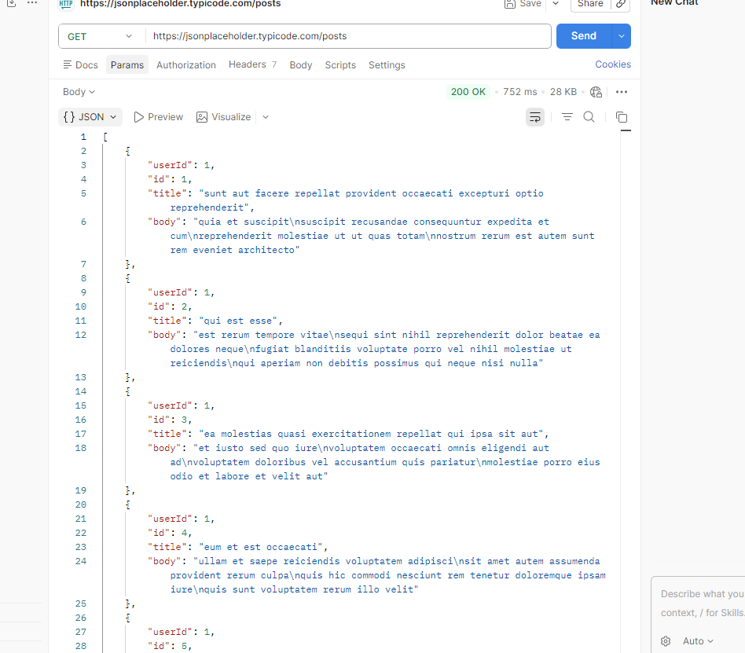
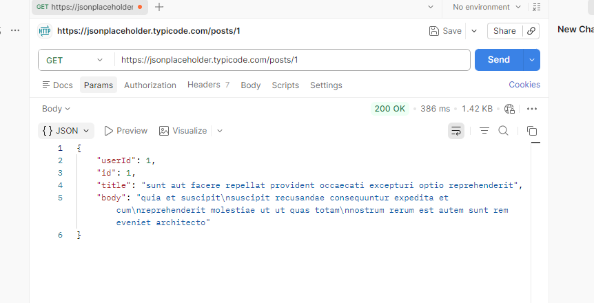
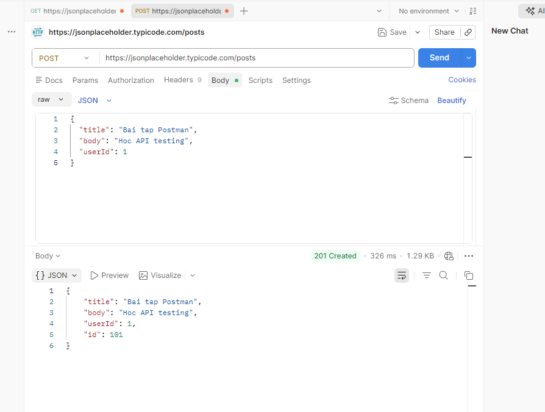
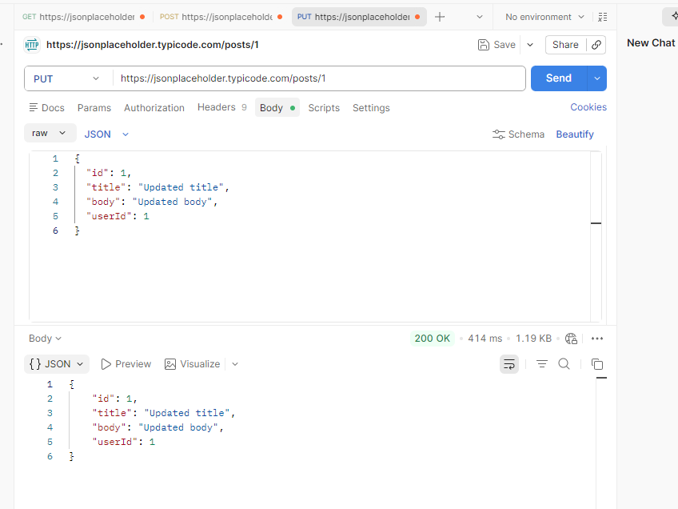
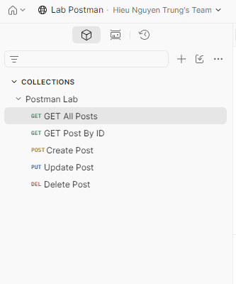

# BÀI TẬP POSTMAN API TESTING

## Thông tin sinh viên

Họ tên: Nguyễn Trung Hiếu,
lab-7: API Testing,
công cụ: Postman.

# Giới thiệu

Bài tập thực hành kiểm thử API bằng Postman.

Sử dụng API miễn phí:

https://jsonplaceholder.typicode.com/

# 1. Test API GET

## Lấy danh sách bài viết

Endpoint:
```text
GET https://jsonplaceholder.typicode.com/posts
```
Kết quả:



# 2. Test API GET By ID

Endpoint:

```text
GET https://jsonplaceholder.typicode.com/posts/1
```

Kết quả:



# 3. Test API POST

Endpoint:

```text
POST https://jsonplaceholder.typicode.com/posts
```

Body:

```json
{
  "title": "Bai tap Postman",
  "body": "Hoc API testing",
  "userId": 1
}
```

Kết quả:



# 4. Test API PUT

Endpoint:

```text
PUT https://jsonplaceholder.typicode.com/posts/1
```

Kết quả:



# 5. Test API DELETE

Endpoint:

```text
DELETE https://jsonplaceholder.typicode.com/posts/1
```

Kết quả:


# 6. Collection trong Postman



# 7. Export Collection JSON

File:

```text
Postman Lab.postman_collection.json
```

# Kết luận
- Hiểu cách sử dụng Postman Web
- Biết test API bằng GET, POST, PUT, DELETE
- Biết export collection
- Biết upload GitHub
